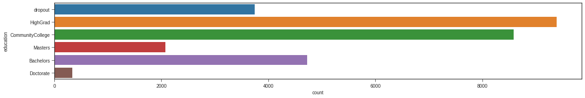
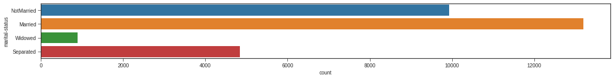
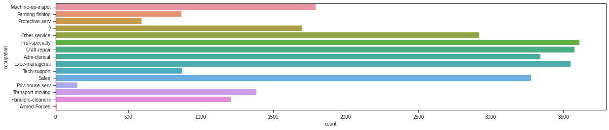

# 💰 ML Income Prediction (Census Data)

## 📌 Project Overview
This project leverages **Machine Learning** to predict whether an individual earns more than $50,000 annually based on census data. The analysis is performed in a Jupyter Notebook (`ML_MiniProject.ipynb`), covering data preprocessing, exploratory data analysis (EDA), and classification modeling.

## 🎯 Goal
Build a predictive model to classify income levels (`<=50K` vs `>50K`) and identify key demographic factors influencing earning potential.

## 📊 Key Features
*   **Data Cleaning**: Handling missing values and categorical data.
*   **Feature Engineering**:
    *   Grouping education levels (e.g., `10th`, `11th` -> `dropout`).
    *   Simplifying marital status categories.
*   **Exploratory Data Analysis (EDA)**: Visualizing distributions of Age, Education, Occupation, and more against Income classes.
*   **Model Building**: (Logistic Regression / Decision Trees / Random Forest / etc.) *[Note: Check notebook for specific models used]*

## 📂 Files Included
```text
.
├── 📄 ML_MiniProject.ipynb   # Main analysis notebook
├── 📄 adult.csv              # Dataset (or linked in notebook)
├── 📂 Assets                 # Extracted result plots
│   ├── output_0.png          # Target Variable Distribution
│   ├── output_1.png          # Education Level Analysis
│   ├── output_2.png          # Marital Status Breakdown
│   └── output_3.png          # Occupation Insights
├── 📄 requirements.txt       # Python dependencies
└── 📄 README.md              # Project documentation
```

## 🛠️ Prerequisites & Setup
1.  **Install Python** (3.7+)
2.  **Install Dependencies**:
    ```bash
    pip install -r requirements.txt
    ```
    *   `pandas`
    *   `numpy`
    *   `seaborn`
    *   `matplotlib`
    *   `scikit-learn`
    *   `notebook`

## 🚀 Usage
1.  **Launch Jupyter Notebook**:
    ```bash
    jupyter notebook
    ```
2.  Open `ML_MiniProject.ipynb`.
3.  Run all cells to reproduce the analysis and model training.

## 📈 Results & Analysis (Extracted)

### 1. Income Class Distribution
The dataset is imbalanced, with significantly more individuals earning <=50K.


### 2. Impact of Education
Higher education levels generally correlate with higher income.


### 3. Marital Status & Occupation
Insights into how family status and job roles affect income probability.



## 🤝 Credits
*   **Author**: Karthik Kumar Reddy Kota
*   **Dataset**: Adult Census Income Dataset (UCI Machine Learning Repository)